# IRShine
***Ultra high power and long range*** ultimate IR blaster with ***ESP8266*** controller and ***Osram Oslon(R) 150° IR emitter***

<p align="center">
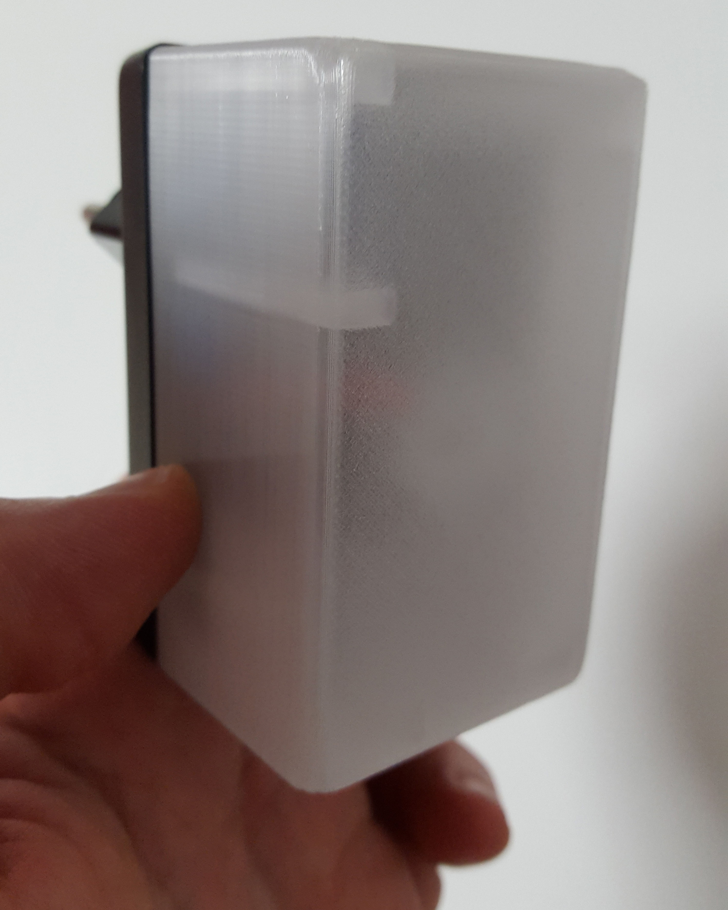 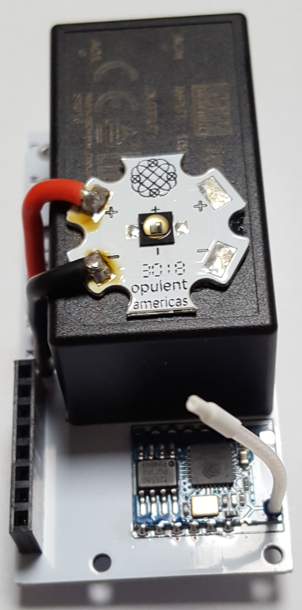 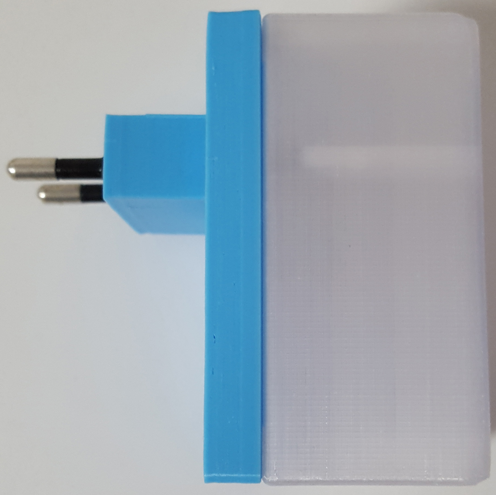
</p>

***Features:***
- Ultra long range at any angle when used as a universal remote. It works even behind the closets
- Osram Oslon(R) Black SFH4726S <b>3.4 W</b> 940 nm IR emitter with radiation angle of <b>150°</b>
- ESP8266 controller (ESP-03 with 1 MB flash)
- LDO regulator with fast transient response permits stable operation and IR radiant intensity regulation
- Expansion slot with two additional GPIOs that can be used with daughter micro cards for an IR receiver and/or any other I/O function supported by ESP8266's firmware
- Integrated 8.3 W power supply (Meanwell IRM-10-3.3) with 80-264 VAC input voltage range
- Very small: it is simply a power plug box with a transparent cap for IR emission

<p align="center">
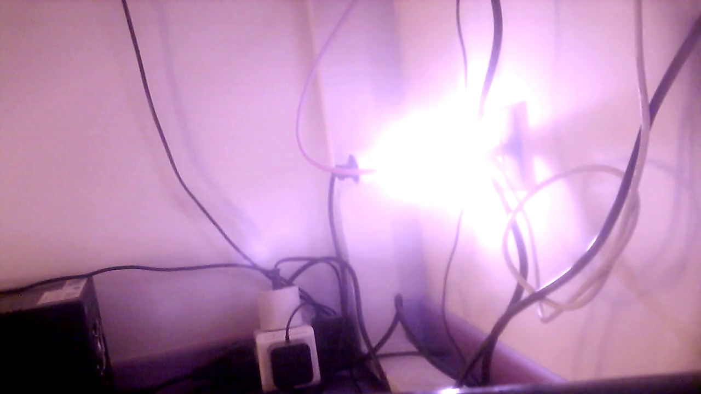 <br>
Video of a test recorded with a webcam without infrared cut-off filter: <a href="https://youtu.be/zH2w6j8X1IQ">https://youtu.be/zH2w6j8X1IQ</a>
</p>

<p align="center">
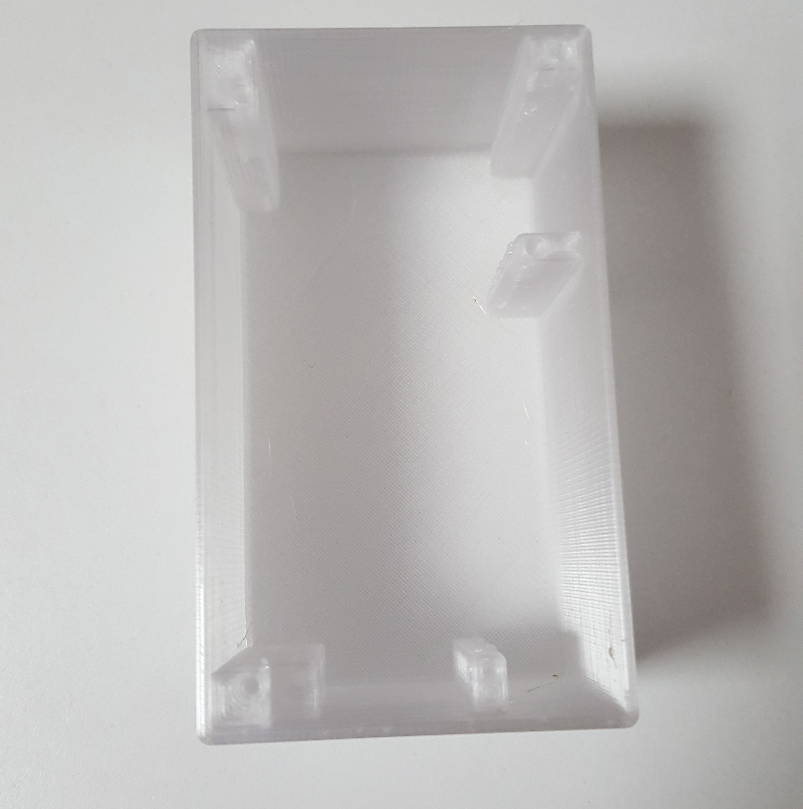 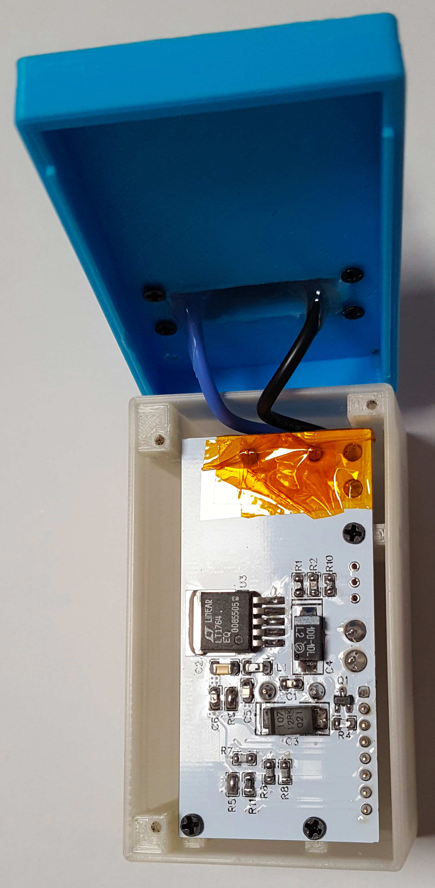 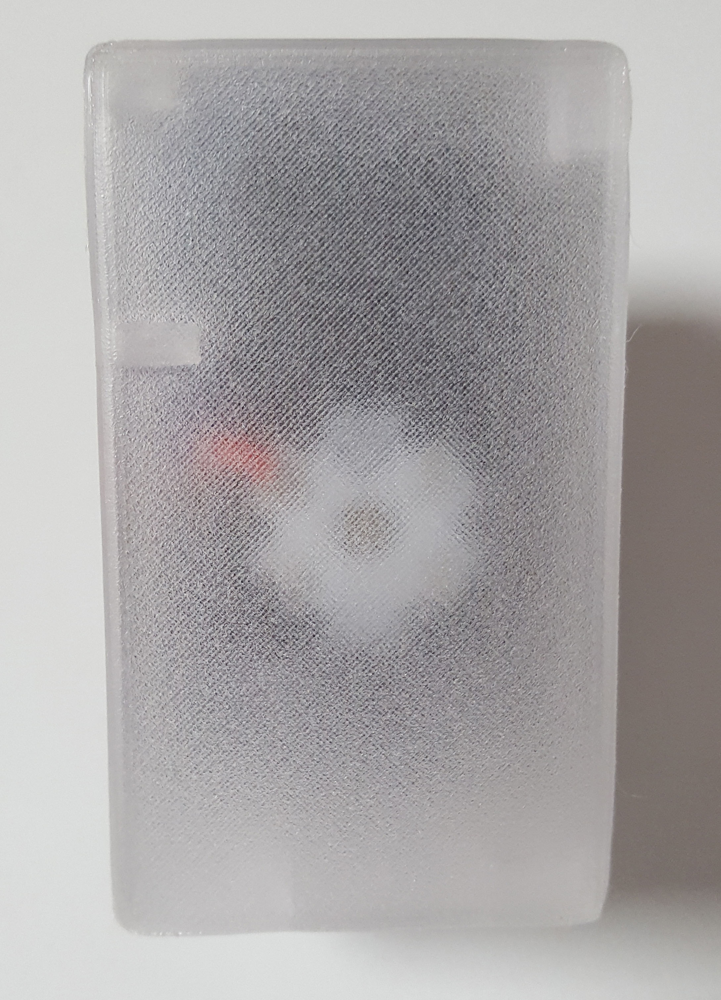 <br>
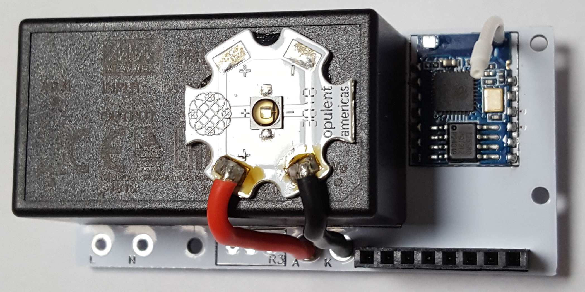 <br> 
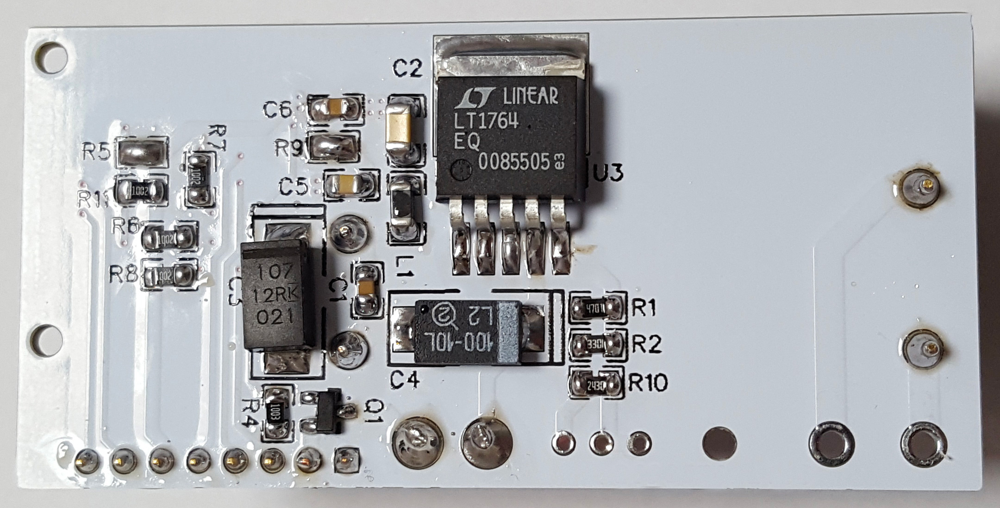 <br>
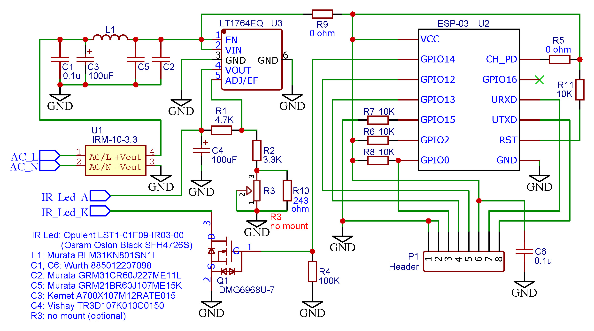
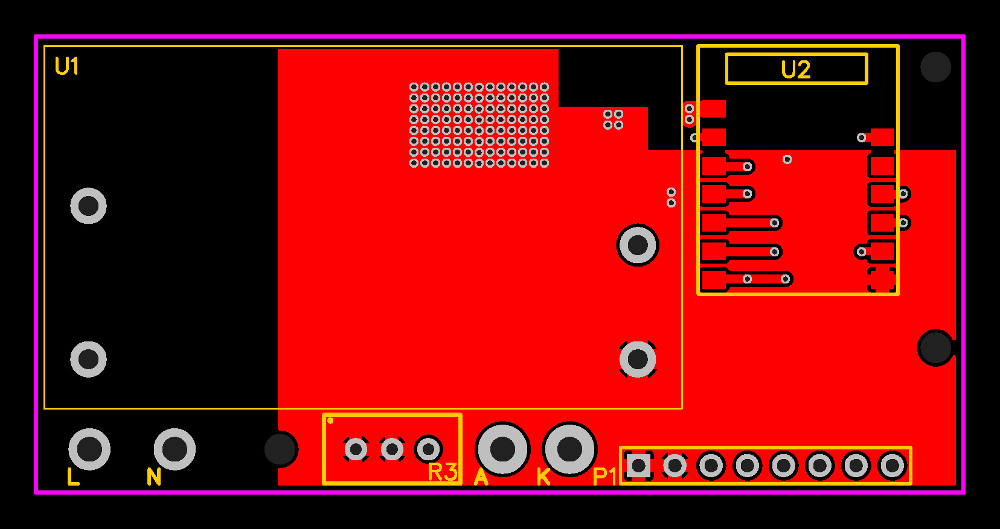 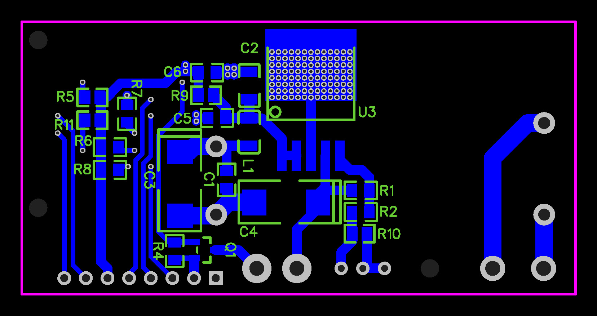
</p>

***The pinout of expansion slot P1 is:***
- 1: GND
- 2: GND
- 3: ESP8266 GPIO0 - connect to GND (pin 2) to flash the firmware
- 4: ESP8266 GPIO13
- 5: ESP8266 GPIO12
- 6: +3.3V
- 7: ESP8266 RXD
- 8: ESP8266 TXD

<p align="justify">
To flash a firmware of your choice you need an FTDI programmer. It is necessary to disconnect the IRShine from the power outlet, open the solder joint R9 because during the firmware flash the ESP8266 is powered by the FTDI programmer, short the GPIO0 input (slot P1, pin 3) to GND, connect the FTDI programmer to the expansion slot P1 (GND, +3.3V, TXD and RXD) and flash the firmware.<br>
When the firmware is flashed you can remove the FTDI programmer, close the solder joint R9 and plug the IRShine into the power outlet.<br>
To extend the wifi range of the esp-03 controller you can replace the integrated ceramic antenna with a 3 cm wire as seen in the photos<br>
To mount the PCB, three self tapping screws M2x7 and three M2x16 are necessary to connect the top cover to the plug box.
</p>

***The IRShine uses ESP8266 GPIO14 to control the power led emitter***

***Bill of materials:***
- U1 -  Meanwell IRM-10-3.3
- U2 -  ESP8266 module ESP-03 with 1MB flash
- U3 -  Analog/Linear LT1764EQ#PBF
- Q1 -  Diodes Inc DMG6968U-7
- R1 -  4.7K 1% 1/8W SMD 0805
- R2 -  3.3K 1% 1/8W SMD 0805
- R3 -  Optional trimmer (no mount)
- R4 -  100K 1% 1/8W SMD 0805
- R5 -  0 ohm (solder joint)
- R6 -  10K 1% 1/8W SMD 0805
- R7 -  10K 1% 1/8W SMD 0805
- R8 -  10K 1% 1/8W SMD 0805
- R9 -  0 ohm (solder joint)
- R10 - 243 ohm 1% 1/8W SMD 0805
- R11 - 10K 1% 1/8W SMD 0805
- C1, C6 -  Wurth 885012207098
- C2 -  Murata GRM31CR60J227ME11L
- C3 -  Kemet A700X107M12RATE015
- C4 -  Vishay TR3D107K010C0150
- C5 -  Murata GRM21BR60J107ME15K
- L1 -  Murata BLM31KN801SN1L
- IR Power LED emitter 940nm: Opulent LST1-01F09-IR03-00 (Osram Oslon Black SFH4726S)
- P1 -	Header 2.54mm 8 pins
- Plug box - 3D printed, see folder [plug_box](https://github.com/IacoT1/IRShine/tree/master/plug_box) for STL files

<br><br>

***---OPTIONAL Daughter Card with IR receiver---***
<p align="center">
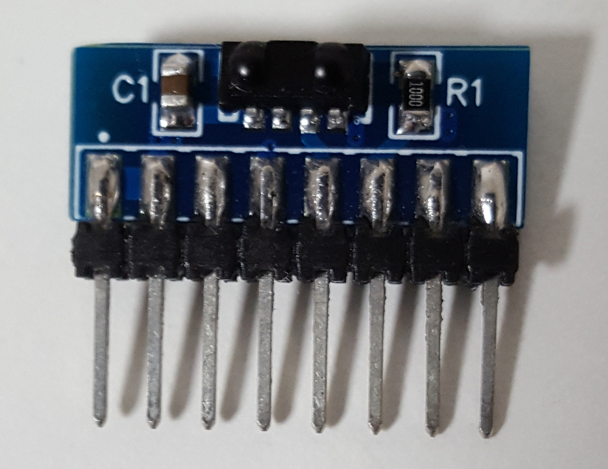 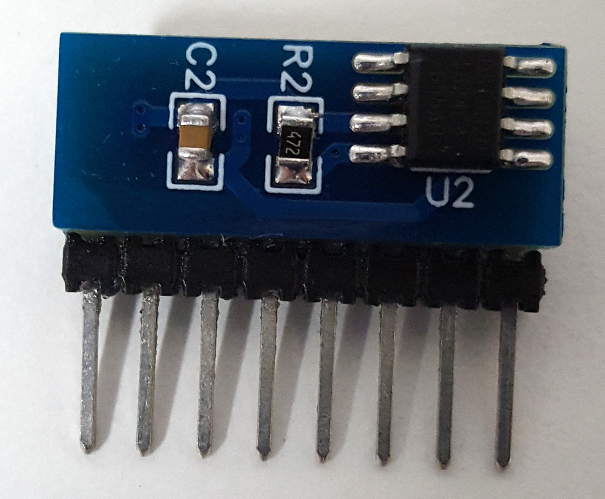
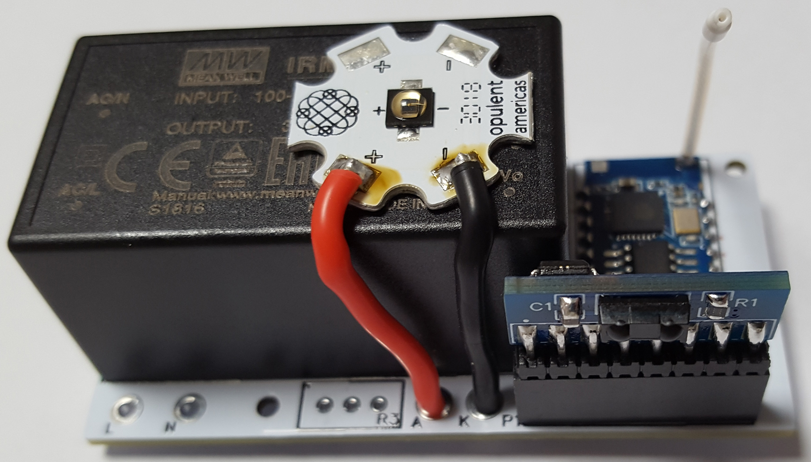 
</p>

<p align="justify">
The daughter card further expands the capabilities of IRShine by adding a universal IR receiver and an optional temperature sensor. The card is extremely small, fully integrated with the mainboard and fits perfectly into the plug box.
</p>

<p align="center">
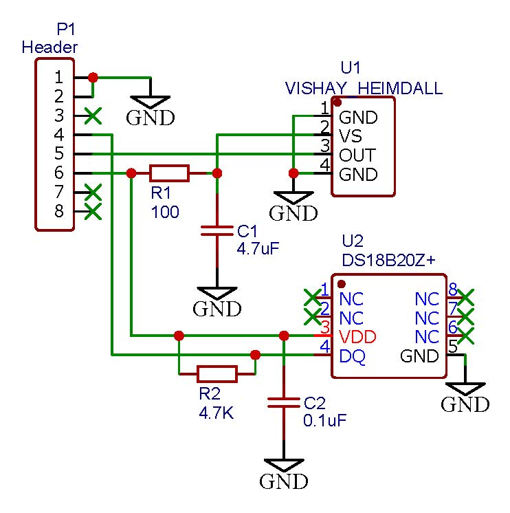 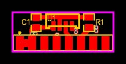 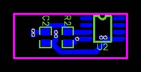
</p>

<p align="justify">
The daughter card is compatible and can mount ANY <a href="https://www.vishay.com/ir-receiver-modules/heimdall">Vishay Heimdall IR receiver</a> for carrier frequencies of 30, 33, 36, 38, 40 and 56 kHz and it can support any IR protocol.
The optional temperature sensor is a DS18B20 and can be used to monitor the temperature inside the plug box.
</p>

***The daughter card uses ESP8266 GPIO12 for the IR receiver and GPIO13 for the temperature sensor***

***Bill of materials of daughter card:***
- U1 - ANY Vishay Heimdall IR receiver (see [all models here](https://www.vishay.com/ir-receiver-modules/heimdall))
- U2 - ***optional*** DS18B20Z+
- R1 - 100ohm 1% 1/8W SMD 0805
- C1 - 4.7uF X7R SMD 0805
- R2 - ***optional*** 4.7K 1% 1/8W SMD 0805
- C2 - ***optional*** 0.1uF X7R SMD 0805
- P1 - Pin strip 2.54mm 8 pins

<br>

***Configuration of Tasmota firmware for IRShine***
<p align="justify">
It is recommended to use latest version of Tasmota (release 8).<br>
The configuration template for IRShine is:
</p>

```
{"NAME":"HPIRBlaster","GPIO":[0,0,0,0,0,0,0,0,51,4,8,0,0],"FLAG":0,"BASE":18}
```

<p align="justify">
With <a href="https://tasmota.github.io/docs/">Tasmota firmware</a> it is possible to send and receive MQTT infrared commands. In this example the MQTT topic is "hpir01" and the command will control any Samsung TV: <br>
- topic: cmnd/hpir01/IRSEND <br>
- payload for TV switch on: {"Protocol":"SAMSUNG","Bits":32,"Data":0xE0E0F00F} <br>
- payload for TV switch off: {"Protocol":"SAMSUNG","Bits":32,"Data":0xE0E019E6} <br>
With this configuration Tasmota also receives and decodes the infrared commands sent by external remote controls and transmits them with the MQTT protocol. In this example, IRShine receives an external IR NEC command and sends the corresponding MQTT message: <br>
- topic: tele/hpir01/RESULT <br>
- payload: {"IrReceived":{"Protocol":"NEC","Bits":32,"Data":"0x40BD906F"}} <br> <br>
</p>

***Connect IRShine to Amazon Alexa or Google Home***
<p align="justify">
You can use <a href="https://red.cb-net.co.uk/">Node-RED Smart Home Control</a> to connect the IRShine to Alexa or Google Home. <br>
Assuming that you have already flashed IRShine with the tasmota firmware configured as in the previous example and configured your Node-RED Smart Home Control with three TV devices, you can use the following flow to control three Samsung TVs located in separate rooms. The flow permits to switch on and off, control the volume and change channel number.
You can also easily adapt the flow to any TV model by changing the payloads corresponding to each key of your existing TV remote. To view the IR code sent by your TV remote: <br>
- access the web interface of IRShine Tasmota <br>
- access the tasmota console <br>
- click the button of your remote pointing to the IRShine <br>
- the code will be displayed as a console message <br>
</p>
<p align="center">

</p>

```
[{"id":"aabaab9a.af68b","type":"tab","label":"Flow 1","disabled":false,"info":""},{"id":"e4d5c978.3a0ef8","type":"function","z":"aabaab9a.af68b","name":"split channel number digits","func":"let numParts = msg.payload.split('');\nmsg.payload = numParts\nreturn msg;","outputs":1,"noerr":0,"x":600,"y":440,"wires":[["2deb34ef.d87294"]]},{"id":"2deb34ef.d87294","type":"split","z":"aabaab9a.af68b","name":"send a message for each digit","splt":"\\n","spltType":"str","arraySplt":1,"arraySpltType":"len","stream":false,"addname":"","x":610,"y":500,"wires":[["ac03430.20e9fc"]]},{"id":"ac03430.20e9fc","type":"delay","z":"aabaab9a.af68b","name":"","pauseType":"rate","timeout":"1","timeoutUnits":"seconds","rate":"2","nbRateUnits":"1","rateUnits":"second","randomFirst":"1","randomLast":"5","randomUnits":"seconds","drop":false,"x":550,"y":560,"wires":[["94f37837.83c0b8"]]},{"id":"94f37837.83c0b8","type":"switch","z":"aabaab9a.af68b","name":"digit","property":"payload","propertyType":"msg","rules":[{"t":"eq","v":" ","vt":"str"},{"t":"eq","v":"0","vt":"str"},{"t":"eq","v":"1","vt":"str"},{"t":"eq","v":"2","vt":"str"},{"t":"eq","v":"3","vt":"str"},{"t":"eq","v":"4","vt":"str"},{"t":"eq","v":"5","vt":"str"},{"t":"eq","v":"6","vt":"str"},{"t":"eq","v":"7","vt":"str"},{"t":"eq","v":"8","vt":"str"},{"t":"eq","v":"9","vt":"str"}],"checkall":"false","repair":false,"outputs":11,"x":710,"y":680,"wires":[[],["91057768.0fd46"],["deec37ab.00a53"],["1a284ef0.86c531"],["90f46182.ae65a8"],["ffbe4b1b.4231"],["ae7b4483.568568"],["28e1cfb2.1b9cd8"],["b9cdef18.6099c8"],["294486e5.0f9ab2"],["fc961996.17b528"]]},{"id":"91057768.0fd46","type":"change","z":"aabaab9a.af68b","name":"\"0\"","rules":[{"t":"set","p":"payload","pt":"msg","to":"{\"Protocol\":\"SAMSUNG\",\"Bits\":32,\"Data\":0xE0E08877}","tot":"str"}],"action":"","property":"","from":"","to":"","reg":false,"x":910,"y":380,"wires":[["67966d6f.8af5fc"]]},{"id":"deec37ab.00a53","type":"change","z":"aabaab9a.af68b","name":"\"1\"","rules":[{"t":"set","p":"payload","pt":"msg","to":"{\"Protocol\":\"SAMSUNG\",\"Bits\":32,\"Data\":0xE0E020DF}","tot":"str"}],"action":"","property":"","from":"","to":"","reg":false,"x":910,"y":420,"wires":[["67966d6f.8af5fc"]]},{"id":"1a284ef0.86c531","type":"change","z":"aabaab9a.af68b","name":"\"2\"","rules":[{"t":"set","p":"payload","pt":"msg","to":"{\"Protocol\":\"SAMSUNG\",\"Bits\":32,\"Data\":0xE0E0A05F}","tot":"str"}],"action":"","property":"","from":"","to":"","reg":false,"x":910,"y":460,"wires":[["67966d6f.8af5fc"]]},{"id":"90f46182.ae65a8","type":"change","z":"aabaab9a.af68b","name":"\"3\"","rules":[{"t":"set","p":"payload","pt":"msg","to":"{\"Protocol\":\"SAMSUNG\",\"Bits\":32,\"Data\":0xE0E0609F}","tot":"str"}],"action":"","property":"","from":"","to":"","reg":false,"x":910,"y":500,"wires":[["67966d6f.8af5fc"]]},{"id":"ffbe4b1b.4231","type":"change","z":"aabaab9a.af68b","name":"\"4\"","rules":[{"t":"set","p":"payload","pt":"msg","to":"{\"Protocol\":\"SAMSUNG\",\"Bits\":32,\"Data\":0xE0E010EF}","tot":"str"}],"action":"","property":"","from":"","to":"","reg":false,"x":910,"y":540,"wires":[["67966d6f.8af5fc"]]},{"id":"ae7b4483.568568","type":"change","z":"aabaab9a.af68b","name":"\"5\"","rules":[{"t":"set","p":"payload","pt":"msg","to":"{\"Protocol\":\"SAMSUNG\",\"Bits\":32,\"Data\":0xE0E0906F}","tot":"str"}],"action":"","property":"","from":"","to":"","reg":false,"x":910,"y":580,"wires":[["67966d6f.8af5fc"]]},{"id":"28e1cfb2.1b9cd8","type":"change","z":"aabaab9a.af68b","name":"\"6\"","rules":[{"t":"set","p":"payload","pt":"msg","to":"{\"Protocol\":\"SAMSUNG\",\"Bits\":32,\"Data\":0xE0E050AF}","tot":"str"}],"action":"","property":"","from":"","to":"","reg":false,"x":910,"y":620,"wires":[["67966d6f.8af5fc"]]},{"id":"b9cdef18.6099c8","type":"change","z":"aabaab9a.af68b","name":"\"7\"","rules":[{"t":"set","p":"payload","pt":"msg","to":"{\"Protocol\":\"SAMSUNG\",\"Bits\":32,\"Data\":0xE0E030CF}","tot":"str"}],"action":"","property":"","from":"","to":"","reg":false,"x":910,"y":660,"wires":[["67966d6f.8af5fc"]]},{"id":"294486e5.0f9ab2","type":"change","z":"aabaab9a.af68b","name":"\"8\"","rules":[{"t":"set","p":"payload","pt":"msg","to":"{\"Protocol\":\"SAMSUNG\",\"Bits\":32,\"Data\":0xE0E0B04F}","tot":"str"}],"action":"","property":"","from":"","to":"","reg":false,"x":910,"y":700,"wires":[["67966d6f.8af5fc"]]},{"id":"fc961996.17b528","type":"change","z":"aabaab9a.af68b","name":"\"9\"","rules":[{"t":"set","p":"payload","pt":"msg","to":"{\"Protocol\":\"SAMSUNG\",\"Bits\":32,\"Data\":0xE0E0708F}","tot":"str"}],"action":"","property":"","from":"","to":"","reg":false,"x":910,"y":740,"wires":[["67966d6f.8af5fc"]]},{"id":"66f40150.d4b6f","type":"switch","z":"aabaab9a.af68b","name":"select tv function","property":"command","propertyType":"msg","rules":[{"t":"eq","v":"AdjustVolume","vt":"str"},{"t":"eq","v":"SetMute","vt":"str"},{"t":"eq","v":"TurnOn","vt":"str"},{"t":"eq","v":"TurnOff","vt":"str"},{"t":"eq","v":"ChangeChannel","vt":"str"}],"checkall":"false","repair":false,"outputs":5,"x":570,"y":360,"wires":[["ed8f0a98.7730d"],["968834ce.8d74c"],["24903fab.dbad58"],["5665e57d.75960c"],["e4d5c978.3a0ef8"]]},{"id":"24903fab.dbad58","type":"change","z":"aabaab9a.af68b","name":"turn on","rules":[{"t":"set","p":"payload","pt":"msg","to":"{\"Protocol\":\"SAMSUNG\",\"Bits\":32,\"Data\":0xE0E09966}","tot":"str"}],"action":"","property":"","from":"","to":"","reg":false,"x":900,"y":300,"wires":[["67966d6f.8af5fc"]]},{"id":"5665e57d.75960c","type":"change","z":"aabaab9a.af68b","name":"turn off","rules":[{"t":"set","p":"payload","pt":"msg","to":"{\"Protocol\":\"SAMSUNG\",\"Bits\":32,\"Data\":0xE0E019E6}","tot":"str"}],"action":"","property":"","from":"","to":"","reg":false,"x":900,"y":340,"wires":[["67966d6f.8af5fc"]]},{"id":"ed8f0a98.7730d","type":"switch","z":"aabaab9a.af68b","name":"tv volume","property":"payload","propertyType":"msg","rules":[{"t":"gt","v":"0","vt":"num"},{"t":"lt","v":"0","vt":"num"}],"checkall":"false","repair":false,"outputs":2,"x":680,"y":200,"wires":[["d8f92b70.79c898"],["b8b02f17.46975"]]},{"id":"d8f92b70.79c898","type":"change","z":"aabaab9a.af68b","name":"turn up volume","rules":[{"t":"set","p":"payload","pt":"msg","to":"{\"Protocol\":\"SAMSUNG\",\"Bits\":32,\"Data\":0xE0E0E01F}","tot":"str"}],"action":"","property":"","from":"","to":"","reg":false,"x":880,"y":180,"wires":[["67966d6f.8af5fc"]]},{"id":"b8b02f17.46975","type":"change","z":"aabaab9a.af68b","name":"turn down volume","rules":[{"t":"set","p":"payload","pt":"msg","to":"{\"Protocol\":\"SAMSUNG\",\"Bits\":32,\"Data\":0xE0E0D02F}","tot":"str"}],"action":"","property":"","from":"","to":"","reg":false,"x":870,"y":220,"wires":[["67966d6f.8af5fc"]]},{"id":"968834ce.8d74c","type":"change","z":"aabaab9a.af68b","name":"mute the tv","rules":[{"t":"set","p":"payload","pt":"msg","to":"{\"Protocol\":\"SAMSUNG\",\"Bits\":32,\"Data\":0xE0E0F00F}","tot":"str"}],"action":"","property":"","from":"","to":"","reg":false,"x":890,"y":260,"wires":[["67966d6f.8af5fc"]]},{"id":"67966d6f.8af5fc","type":"switch","z":"aabaab9a.af68b","name":"which tv?","property":"name","propertyType":"msg","rules":[{"t":"eq","v":"lounge tv","vt":"str"},{"t":"eq","v":"kitchen tv","vt":"str"},{"t":"eq","v":"bedroom tv","vt":"str"}],"checkall":"true","repair":false,"outputs":3,"x":1080,"y":740,"wires":[["bbe8ae81.d9327"],["6536eb45.fa7b34"],["9afe9d85.38e1d"]]},{"id":"bbe8ae81.d9327","type":"mqtt out","z":"aabaab9a.af68b","name":"","topic":"cmnd/hpir01/IRSEND","qos":"","retain":"","broker":"","x":1320,"y":660,"wires":[]},{"id":"6536eb45.fa7b34","type":"mqtt out","z":"aabaab9a.af68b","name":"","topic":"cmnd/hpir02/IRSEND","qos":"","retain":"","broker":"","x":1320,"y":700,"wires":[]},{"id":"9afe9d85.38e1d","type":"mqtt out","z":"aabaab9a.af68b","name":"","topic":"cmnd/hpir03/IRSEND","qos":"","retain":"","broker":"","x":1320,"y":740,"wires":[]}]
```
<br>

***Use IRShine as a "tv remote translator"***
<p align="justify">
Since IRShine can both receive and transmit IR signals, it is possible to use it as a translator, that is, to use a remote control of a certain TV to control a TV of another brand, it is therefore possible to control TVs of different brands all with the same remote control. This can be useful for people accustomed to using a certain remote control and who don't want to change it when they change TV.
In the following example a Trekstor remote that emits NEC IR codes is used to control any Samsung TV. The IRShine receives a Trekstor command and then send the corresponding Samsung command. <br>
</p>
<p align="center">

</p>

```
[{"id":"9790f531.d60c08","type":"tab","label":"Flow 2","disabled":false,"info":""},{"id":"2013bc7a.0ea98c","type":"mqtt in","z":"9790f531.d60c08","name":"irrcv01","topic":"tele/hpir01/RESULT","qos":"2","datatype":"auto","broker":"","x":150,"y":180,"wires":[["1f3b3106.26aa57"]]},{"id":"5d8b6ff4.3fd318","type":"change","z":"9790f531.d60c08","name":"","rules":[{"t":"set","p":"payload","pt":"msg","to":"{\"Protocol\":\"SAMSUNG\",\"Bits\":32,\"Data\":0xE0E08877}","tot":"str"}],"action":"","property":"","from":"","to":"","reg":false,"x":520,"y":140,"wires":[["be1c19bc.0b453"]]},{"id":"5813baaf.8dd72c","type":"change","z":"9790f531.d60c08","name":"","rules":[{"t":"set","p":"payload","pt":"msg","to":"{\"Protocol\":\"SAMSUNG\",\"Bits\":32,\"Data\":0xE0E020DF}","tot":"str"}],"action":"","property":"","from":"","to":"","reg":false,"x":520,"y":180,"wires":[["be1c19bc.0b453"]]},{"id":"f16529f6.c5d5f","type":"change","z":"9790f531.d60c08","name":"","rules":[{"t":"set","p":"payload","pt":"msg","to":"{\"Protocol\":\"SAMSUNG\",\"Bits\":32,\"Data\":0xE0E0A05F}","tot":"str"}],"action":"","property":"","from":"","to":"","reg":false,"x":520,"y":220,"wires":[["be1c19bc.0b453"]]},{"id":"81b990a1.4786d","type":"change","z":"9790f531.d60c08","name":"","rules":[{"t":"set","p":"payload","pt":"msg","to":"{\"Protocol\":\"SAMSUNG\",\"Bits\":32,\"Data\":0xE0E0609F}","tot":"str"}],"action":"","property":"","from":"","to":"","reg":false,"x":520,"y":260,"wires":[["be1c19bc.0b453"]]},{"id":"9c5d506f.d6ae28","type":"change","z":"9790f531.d60c08","name":"","rules":[{"t":"set","p":"payload","pt":"msg","to":"{\"Protocol\":\"SAMSUNG\",\"Bits\":32,\"Data\":0xE0E010EF}","tot":"str"}],"action":"","property":"","from":"","to":"","reg":false,"x":520,"y":300,"wires":[["be1c19bc.0b453"]]},{"id":"e7ccc6b5.411788","type":"change","z":"9790f531.d60c08","name":"","rules":[{"t":"set","p":"payload","pt":"msg","to":"{\"Protocol\":\"SAMSUNG\",\"Bits\":32,\"Data\":0xE0E0906F}","tot":"str"}],"action":"","property":"","from":"","to":"","reg":false,"x":520,"y":340,"wires":[["be1c19bc.0b453"]]},{"id":"63b734fc.a23cf4","type":"change","z":"9790f531.d60c08","name":"","rules":[{"t":"set","p":"payload","pt":"msg","to":"{\"Protocol\":\"SAMSUNG\",\"Bits\":32,\"Data\":0xE0E050AF}","tot":"str"}],"action":"","property":"","from":"","to":"","reg":false,"x":520,"y":380,"wires":[["be1c19bc.0b453"]]},{"id":"b84ea10a.cc279","type":"change","z":"9790f531.d60c08","name":"","rules":[{"t":"set","p":"payload","pt":"msg","to":"{\"Protocol\":\"SAMSUNG\",\"Bits\":32,\"Data\":0xE0E030CF}","tot":"str"}],"action":"","property":"","from":"","to":"","reg":false,"x":520,"y":420,"wires":[["be1c19bc.0b453"]]},{"id":"d226799e.a22bb","type":"change","z":"9790f531.d60c08","name":"","rules":[{"t":"set","p":"payload","pt":"msg","to":"{\"Protocol\":\"SAMSUNG\",\"Bits\":32,\"Data\":0xE0E0B04F}","tot":"str"}],"action":"","property":"","from":"","to":"","reg":false,"x":520,"y":460,"wires":[["be1c19bc.0b453"]]},{"id":"b39c0027.fed97","type":"change","z":"9790f531.d60c08","name":"","rules":[{"t":"set","p":"payload","pt":"msg","to":"{\"Protocol\":\"SAMSUNG\",\"Bits\":32,\"Data\":0xE0E0708F}","tot":"str"}],"action":"","property":"","from":"","to":"","reg":false,"x":520,"y":500,"wires":[["be1c19bc.0b453"]]},{"id":"70361059.a5b108","type":"change","z":"9790f531.d60c08","name":"","rules":[{"t":"set","p":"payload","pt":"msg","to":"{\"Protocol\":\"SAMSUNG\",\"Bits\":32,\"Data\":0xE0E040BF}","tot":"str"}],"action":"","property":"","from":"","to":"","reg":false,"x":520,"y":540,"wires":[["be1c19bc.0b453"]]},{"id":"87611e2b.f2cbd8","type":"change","z":"9790f531.d60c08","name":"","rules":[{"t":"set","p":"payload","pt":"msg","to":"{\"Protocol\":\"SAMSUNG\",\"Bits\":32,\"Data\":0xE0E0F00F}","tot":"str"}],"action":"","property":"","from":"","to":"","reg":false,"x":520,"y":580,"wires":[["be1c19bc.0b453"]]},{"id":"4aa50a51.cf657c","type":"change","z":"9790f531.d60c08","name":"","rules":[{"t":"set","p":"payload","pt":"msg","to":"{\"Protocol\":\"SAMSUNG\",\"Bits\":32,\"Data\":0xE0E0E01F}","tot":"str"}],"action":"","property":"","from":"","to":"","reg":false,"x":520,"y":620,"wires":[["be1c19bc.0b453"]]},{"id":"58c55ca9.27b82c","type":"change","z":"9790f531.d60c08","name":"","rules":[{"t":"set","p":"payload","pt":"msg","to":"{\"Protocol\":\"SAMSUNG\",\"Bits\":32,\"Data\":0xE0E0D02F}","tot":"str"}],"action":"","property":"","from":"","to":"","reg":false,"x":520,"y":660,"wires":[["be1c19bc.0b453"]]},{"id":"95d70bb5.82c99","type":"change","z":"9790f531.d60c08","name":"","rules":[{"t":"set","p":"payload","pt":"msg","to":"{\"Protocol\":\"SAMSUNG\",\"Bits\":32,\"Data\":0xE0E048B7}","tot":"str"}],"action":"","property":"","from":"","to":"","reg":false,"x":520,"y":700,"wires":[["be1c19bc.0b453"]]},{"id":"6f616f62.60bcc8","type":"change","z":"9790f531.d60c08","name":"","rules":[{"t":"set","p":"payload","pt":"msg","to":"{\"Protocol\":\"SAMSUNG\",\"Bits\":32,\"Data\":0xE0E008F7}","tot":"str"}],"action":"","property":"","from":"","to":"","reg":false,"x":520,"y":740,"wires":[["be1c19bc.0b453"]]},{"id":"1f3b3106.26aa57","type":"switch","z":"9790f531.d60c08","name":"","property":"payload","propertyType":"msg","rules":[{"t":"eq","v":"{\"IrReceived\":{\"Protocol\":\"NEC\",\"Bits\":32,\"Data\":\"0x40BD906F\"}}","vt":"str"},{"t":"eq","v":"{\"IrReceived\":{\"Protocol\":\"NEC\",\"Bits\":32,\"Data\":\"0x40BD00FF\"}}","vt":"str"},{"t":"eq","v":"{\"IrReceived\":{\"Protocol\":\"NEC\",\"Bits\":32,\"Data\":\"0x40BD807F\"}}","vt":"str"},{"t":"eq","v":"{\"IrReceived\":{\"Protocol\":\"NEC\",\"Bits\":32,\"Data\":\"0x40BD40BF\"}}","vt":"str"},{"t":"eq","v":"{\"IrReceived\":{\"Protocol\":\"NEC\",\"Bits\":32,\"Data\":\"0x40BDC03F\"}}","vt":"str"},{"t":"eq","v":"{\"IrReceived\":{\"Protocol\":\"NEC\",\"Bits\":32,\"Data\":\"0x40BD20DF\"}}","vt":"str"},{"t":"eq","v":"{\"IrReceived\":{\"Protocol\":\"NEC\",\"Bits\":32,\"Data\":\"0x40BDA05F\"}}","vt":"str"},{"t":"eq","v":"{\"IrReceived\":{\"Protocol\":\"NEC\",\"Bits\":32,\"Data\":\"0x40BD609F\"}}","vt":"str"},{"t":"eq","v":"{\"IrReceived\":{\"Protocol\":\"NEC\",\"Bits\":32,\"Data\":\"0x40BDE01F\"}}","vt":"str"},{"t":"eq","v":"{\"IrReceived\":{\"Protocol\":\"NEC\",\"Bits\":32,\"Data\":\"0x40BD10EF\"}}","vt":"str"},{"t":"eq","v":"{\"IrReceived\":{\"Protocol\":\"NEC\",\"Bits\":32,\"Data\":\"0x40BDA25D\"}}","vt":"str"},{"t":"eq","v":"{\"IrReceived\":{\"Protocol\":\"NEC\",\"Bits\":32,\"Data\":\"0x40BD50AF\"}}","vt":"str"},{"t":"eq","v":"{\"IrReceived\":{\"Protocol\":\"NEC\",\"Bits\":32,\"Data\":\"0x40BDF807\"}}","vt":"str"},{"t":"eq","v":"{\"IrReceived\":{\"Protocol\":\"NEC\",\"Bits\":32,\"Data\":\"0x40BD708F\"}}","vt":"str"},{"t":"eq","v":"{\"IrReceived\":{\"Protocol\":\"NEC\",\"Bits\":32,\"Data\":\"0x40BD18E7\"}}","vt":"str"},{"t":"eq","v":"{\"IrReceived\":{\"Protocol\":\"NEC\",\"Bits\":32,\"Data\":\"0x40BD58A7\"}}","vt":"str"},{"t":"eq","v":"{\"IrReceived\":{\"Protocol\":\"NEC\",\"Bits\":32,\"Data\":\"0x40BDD02F\"}}","vt":"str"},{"t":"eq","v":"{\"IrReceived\":{\"Protocol\":\"NEC\",\"Bits\":32,\"Data\":\"0x40BD38C7\"}}","vt":"str"},{"t":"eq","v":"{\"IrReceived\":{\"Protocol\":\"NEC\",\"Bits\":32,\"Data\":\"0x40BDA857\"}}","vt":"str"},{"t":"eq","v":"{\"IrReceived\":{\"Protocol\":\"NEC\",\"Bits\":32,\"Data\":\"0x40BD48B7\"}}","vt":"str"},{"t":"eq","v":"{\"IrReceived\":{\"Protocol\":\"NEC\",\"Bits\":32,\"Data\":\"0x40BDC837\"}}","vt":"str"},{"t":"eq","v":"{\"IrReceived\":{\"Protocol\":\"NEC\",\"Bits\":32,\"Data\":\"0x40BD8877\"}}","vt":"str"},{"t":"eq","v":"{\"IrReceived\":{\"Protocol\":\"NEC\",\"Bits\":32,\"Data\":\"0x40BD08F7\"}}","vt":"str"},{"t":"eq","v":"{\"IrReceived\":{\"Protocol\":\"NEC\",\"Bits\":32,\"Data\":\"0x40BD6897\"}}","vt":"str"},{"t":"eq","v":"{\"IrReceived\":{\"Protocol\":\"NEC\",\"Bits\":32,\"Data\":\"0x40BDF00F\"}}","vt":"str"}],"checkall":"false","repair":false,"outputs":25,"x":310,"y":300,"wires":[["5d8b6ff4.3fd318"],["5813baaf.8dd72c"],["f16529f6.c5d5f"],["81b990a1.4786d"],["9c5d506f.d6ae28"],["e7ccc6b5.411788"],["63b734fc.a23cf4"],["b84ea10a.cc279"],["d226799e.a22bb"],["b39c0027.fed97"],["70361059.a5b108"],["87611e2b.f2cbd8"],["4aa50a51.cf657c"],["58c55ca9.27b82c"],["95d70bb5.82c99"],["6f616f62.60bcc8"],["d33bc9e4.ed4988"],["c7bd3caa.1aaf1"],["f1cb1864.a5c0a"],["b148d669.3f5828"],["ebd1648b.4fba1"],["f041f006.bb367"],["bdc8c2ab.553e78"],["cf94b399.d41ce8"],["9e4055ee.693518"]]},{"id":"be1c19bc.0b453","type":"switch","z":"9790f531.d60c08","name":"","property":"topic","propertyType":"msg","rules":[{"t":"eq","v":"tele/hpir01/RESULT","vt":"str"},{"t":"eq","v":"tele/hpir02/RESULT","vt":"str"},{"t":"eq","v":"tele/hpir03/RESULT","vt":"str"}],"checkall":"false","repair":false,"outputs":3,"x":730,"y":140,"wires":[["239a3277.cae366"],["4b0ce997.7ff628"],["62ed8ed0.76af"]]},{"id":"239a3277.cae366","type":"mqtt out","z":"9790f531.d60c08","name":"","topic":"cmnd/hpir01/IRSEND","qos":"0","retain":"false","broker":"","x":920,"y":140,"wires":[]},{"id":"4b0ce997.7ff628","type":"mqtt out","z":"9790f531.d60c08","name":"","topic":"cmnd/hpir02/IRSEND","qos":"0","retain":"false","broker":"","x":920,"y":200,"wires":[]},{"id":"62ed8ed0.76af","type":"mqtt out","z":"9790f531.d60c08","name":"","topic":"cmnd/hpir03/IRSEND","qos":"0","retain":"false","broker":"","x":920,"y":260,"wires":[]},{"id":"d33bc9e4.ed4988","type":"change","z":"9790f531.d60c08","name":"","rules":[{"t":"set","p":"payload","pt":"msg","to":"{\"Protocol\":\"SAMSUNG\",\"Bits\":32,\"Data\":0xE0E0807F}","tot":"str"}],"action":"","property":"","from":"","to":"","reg":false,"x":520,"y":780,"wires":[["be1c19bc.0b453"]]},{"id":"c7bd3caa.1aaf1","type":"change","z":"9790f531.d60c08","name":"","rules":[{"t":"set","p":"payload","pt":"msg","to":"{\"Protocol\":\"SAMSUNG\",\"Bits\":32,\"Data\":0xE0E01AE5}","tot":"str"}],"action":"","property":"","from":"","to":"","reg":false,"x":520,"y":820,"wires":[["be1c19bc.0b453"]]},{"id":"f1cb1864.a5c0a","type":"change","z":"9790f531.d60c08","name":"","rules":[{"t":"set","p":"payload","pt":"msg","to":"{\"Protocol\":\"SAMSUNG\",\"Bits\":32,\"Data\":0xE0E016E9}","tot":"str"}],"action":"","property":"","from":"","to":"","reg":false,"x":520,"y":860,"wires":[["be1c19bc.0b453"]]},{"id":"b148d669.3f5828","type":"change","z":"9790f531.d60c08","name":"","rules":[{"t":"set","p":"payload","pt":"msg","to":"{\"Protocol\":\"SAMSUNG\",\"Bits\":32,\"Data\":0xE0E006F9}","tot":"str"}],"action":"","property":"","from":"","to":"","reg":false,"x":520,"y":900,"wires":[["be1c19bc.0b453"]]},{"id":"ebd1648b.4fba1","type":"change","z":"9790f531.d60c08","name":"","rules":[{"t":"set","p":"payload","pt":"msg","to":"{\"Protocol\":\"SAMSUNG\",\"Bits\":32,\"Data\":0xE0E08679}","tot":"str"}],"action":"","property":"","from":"","to":"","reg":false,"x":520,"y":940,"wires":[["be1c19bc.0b453"]]},{"id":"f041f006.bb367","type":"change","z":"9790f531.d60c08","name":"","rules":[{"t":"set","p":"payload","pt":"msg","to":"{\"Protocol\":\"SAMSUNG\",\"Bits\":32,\"Data\":0xE0E0A659}","tot":"str"}],"action":"","property":"","from":"","to":"","reg":false,"x":520,"y":980,"wires":[["be1c19bc.0b453"]]},{"id":"bdc8c2ab.553e78","type":"change","z":"9790f531.d60c08","name":"","rules":[{"t":"set","p":"payload","pt":"msg","to":"{\"Protocol\":\"SAMSUNG\",\"Bits\":32,\"Data\":0xE0E046B9}","tot":"str"}],"action":"","property":"","from":"","to":"","reg":false,"x":520,"y":1020,"wires":[["be1c19bc.0b453"]]},{"id":"cf94b399.d41ce8","type":"change","z":"9790f531.d60c08","name":"","rules":[{"t":"set","p":"payload","pt":"msg","to":"{\"Protocol\":\"SAMSUNG\",\"Bits\":32,\"Data\":0xE0E052AD}","tot":"str"}],"action":"","property":"","from":"","to":"","reg":false,"x":520,"y":1060,"wires":[["be1c19bc.0b453"]]},{"id":"9e4055ee.693518","type":"change","z":"9790f531.d60c08","name":"","rules":[{"t":"set","p":"payload","pt":"msg","to":"{\"Protocol\":\"SAMSUNG\",\"Bits\":32,\"Data\":0xE0E0E21D}","tot":"str"}],"action":"","property":"","from":"","to":"","reg":false,"x":520,"y":1100,"wires":[["be1c19bc.0b453"]]},{"id":"cf74de44.782af","type":"mqtt in","z":"9790f531.d60c08","name":"irrcv02","topic":"tele/hpir02/RESULT","qos":"2","datatype":"auto","broker":"","x":150,"y":240,"wires":[["1f3b3106.26aa57"]]},{"id":"18f2c31b.a77045","type":"mqtt in","z":"9790f531.d60c08","name":"irrcv03","topic":"tele/hpir03/RESULT","qos":"2","datatype":"auto","broker":"","x":150,"y":300,"wires":[["1f3b3106.26aa57"]]}]
```
